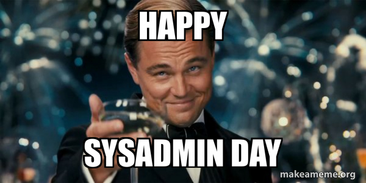

# 🎓 KodeKloud Learning Repository

This repository contains my solutions, notes, and hands-on practice tasks from various **KodeKloud** courses and certification preparations.  
!!!Want to study with me ?!!!
*https://engineer.kodekloud.com/signup?referral=68606811225bb8d2bae91ac7*

---

## 📁 Course Sections

### 🔧 [System Administration]
General Linux and system management tasks.

### 🔀 [Git](./Git/)  
Tasks and labs related to Git version control.

### ☸️ [Kubernetes](./Kubernetes/)
Kubernetes practical labs organized by difficulty level:
- 🧩 [Level 2](./Kubernetes/lvl2/)
- 🧠 Level 3 *(coming soon)*

### 🚀 [100 Days of DevOps](./100days_of_devOps/)  
Daily DevOps challenges and exercises from the #100DaysOfDevOps initiative.

---

## 🎓 Certifications

### ✅ [Kubernetes Administrator Certification (CKA)](./Kubernetes_certification/)  
Preparation tasks, mock exams, and study notes for the Certified Kubernetes Administrator exam.

---

## 🛠️ Author

👤 Aidar  
📍 Personal learning journey | 💡 Self-practice | 🚀 Continuous improvement

---

> *This repository is updated regularly as I progress through each course.*

